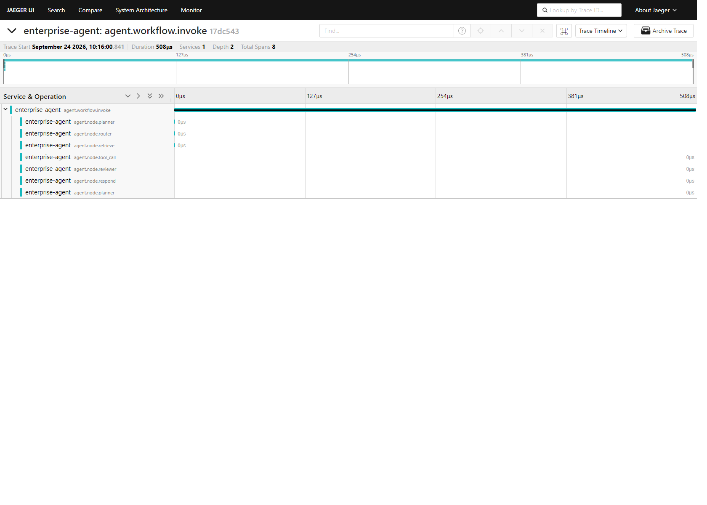

# Enterprise Agent — AI 评测与可观测性

本仓库在生产化方向上提供两块能力：**评测集纳入 CI 回归**（`examples/rag_demo`）与 **OpenTelemetry + Jaeger 全链路可观测性**（`src/enterprise_agent/observability`）。

---

## 1. 评测集纳入 CI 回归

### 1.1 评测集

`examples/rag_demo/rag_demo.py --eval` 内置 6 条企业制度问答评测集（黄金章节人工标注），
在**无 LLM Key 降级模式**下运行，输出三个指标：

| 指标 | 说明 | 当前基线（top_k=3） |
|---|---|---|
| retrieval_accuracy | 检索准确率@K = Top-K 命中黄金章节的提问数 / 总提问数 | 83.33%（5/6） |
| refusal_rate | 拒答率 = 未在 Top-K 检索到完整黄金关键词的提问数 / 总提问数 | 16.67%（1/6） |
| citation_accuracy | 引用来源准确率 = 引用片段包含黄金章节的提问数 / 总提问数 | 83.33%（5/6） |

### 1.2 CI 回归 Job

`.github/workflows/ci.yml` 新增 `eval-rag` job（Python 3.11 / 3.12 双矩阵）：

1. `actions/checkout@v4` + `astral-sh/setup-uv@v4` + `actions/setup-python@v5`
2. `uv sync --all-extras` 同步主依赖
3. `uv pip install chromadb rank-bm25 langchain langchain-core langchain-openai langchain-text-splitters` 补齐评测依赖
4. 运行 `python examples/rag_demo/rag_demo.py --eval --top-k 3`，stdout 重定向为 `rag_eval_report.json`
5. 断言阈值：检索准确率 ≥ 60%、引用准确率 ≥ 60%、拒答率 ≤ 40%，不达标即 CI 失败
6. `actions/upload-artifact@v4` 上传 `rag-eval-report-python{version}` 产物

每次 push / PR 自动触发，评测指标随仓库演进持续回归。

---

## 2. OpenTelemetry + Jaeger 全链路可观测性

### 2.1 架构

```
Agent 会话请求
   │  root span: agent.workflow.invoke  (trace_id 贯穿整条链路)
   ├─ Router   span: agent.node.router
   ├─ Planner  span: agent.node.planner
   ├─ Retrieve span: agent.node.retrieve
   ├─ Tool     span: agent.node.tool_call（多轮工具循环可重复出现）
   ├─ Reviewer span: agent.node.reviewer
   └─ Respond  span: agent.node.respond
        │
        ▼ OTLP (HTTP/protobuf, /v1/traces, 端口 4318)
   Jaeger Collector（jaegertracing/all-in-one）
        │
        ▼
   Jaeger Storage + UI（http://localhost:16686）
```

- **打点端**：`src/enterprise_agent/observability/telemetry.py`
  - `init_telemetry()` 初始化 `TracerProvider` + `BatchSpanProcessor(OTLPSpanExporter)`
  - `traced_node()` 装饰器为编排节点自动创建 span 并记录 `agent.node.duration_ms` 阶段耗时
  - `get_tracer()` 供业务代码获取全局 Tracer
- **节点接入**：`src/enterprise_agent/orchestration/nodes.py` 全部 6 个节点（router / planner / retrieve / tool_call / reviewer / respond）已用 `@traced_node("agent.node.<name>")` 打点；
  `src/enterprise_agent/orchestration/graph.py` 的 `ainvoke / invoke` 创建根 span `agent.workflow.invoke`。
- **存储与 UI**：`docker-compose.yml` 新增 `jaeger` 服务（`jaegertracing/all-in-one:1.57`），
  暴露 16686（UI）/ 4317（gRPC）/ 4318（OTLP HTTP）；`agent-api` 配置 `OTEL_EXPORTER_OTLP_ENDPOINT=http://jaeger:4318`、`OTEL_SERVICE_NAME=enterprise-agent`。

### 2.2 Span 定义

| Span 名称 | 阶段 | 关键 Attributes |
|---|---|---|
| `agent.workflow.invoke` | 一次完整会话（根） | `agent.session_id`, `agent.user_input` |
| `agent.node.router` | 意图路由 | `agent.node.step`, `agent.node.duration_ms` |
| `agent.node.planner` | 任务规划（工具循环可多次） | 同上 |
| `agent.node.retrieve` | 知识检索 | 同上 |
| `agent.node.tool_call` | 工具调用 | 同上 |
| `agent.node.reviewer` | 输出评审 | 同上 |
| `agent.node.respond` | 最终回复 | 同上 |

### 2.3 trace_id 贯穿机制

一次会话请求在最外层创建根 span `agent.workflow.invoke`；编排节点通过 OpenTelemetry
Context（ContextVar）自动继承根 span 的 `trace_id` / `parent_span_id`，形成父子层级。
即使节点异步执行（asyncio task 继承 context），同一会话的所有 span 仍归属同一 trace，
可在 Jaeger 中按 trace 聚合查看各阶段耗时分布。

### 2.4 复现步骤

```bash
# 1) 启动 Jaeger（也可用本地二进制：jaeger-all-in-one.exe --collector.otlp.enabled=true）
docker compose up -d jaeger

# 2) 安装观测依赖（observability extra 已含 opentelemetry 全套）
pip install -e ".[observability]" -i https://pypi.tuna.tsinghua.edu.cn/simple

# 3) 运行一次 Agent 会话（无 LLM Key 自动降级，通过 OTLP 上报到本地 Jaeger）
PYTHONPATH=src python examples/observability/run_trace_demo.py
# 输出示例:
#   trace_id   : 17dc543c69886a74ffe7e06738fc7a65

# 4) Jaeger UI 查询
#   打开 http://localhost:16686 -> Service: enterprise-agent -> Find Traces
#   点击最新 trace 查看 span 列表与阶段耗时
```

### 2.5 真实运行截图

> 截图为本机真实运行 `run_trace_demo.py` 后，在 Jaeger UI（http://localhost:16686）
> trace 详情页抓取，包含 trace_id 贯穿的完整 span 列表与耗时时间轴，未做任何伪造。



实际运行 trace：`17dc543c69886a74ffe7e06738fc7a65`（8 个 span：根 + 7 个节点 span，
其中 planner 出现 2 次对应工具循环）。

---

## 3. 目录速览

| 文件 | 说明 |
|---|---|
| `src/enterprise_agent/observability/telemetry.py` | OTel 初始化 / Tracer / 节点打点装饰器 |
| `src/enterprise_agent/orchestration/nodes.py` | 编排节点（已打点） |
| `src/enterprise_agent/orchestration/graph.py` | 工作流图（根 span） |
| `examples/observability/run_trace_demo.py` | 可观测性演示脚本（上报 Jaeger） |
| `examples/rag_demo/rag_demo.py` | RAG 评测集（CI 回归） |
| `examples/rag_demo/RAG_Eval_Report.md` | 评测指标报告 |
| `.github/workflows/ci.yml` | CI（含 `eval-rag` 回归 job） |
| `docker-compose.yml` | 本地编排（含 Jaeger 服务 + OTLP 环境变量） |
| `docs/observability/jaeger_trace.png` | Jaeger trace 详情页真实截图 |
